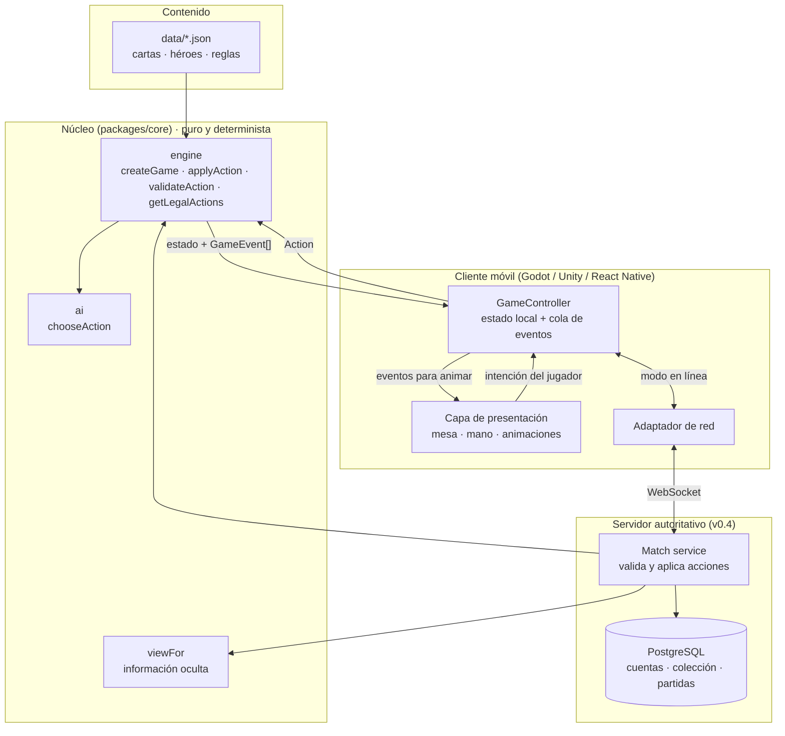
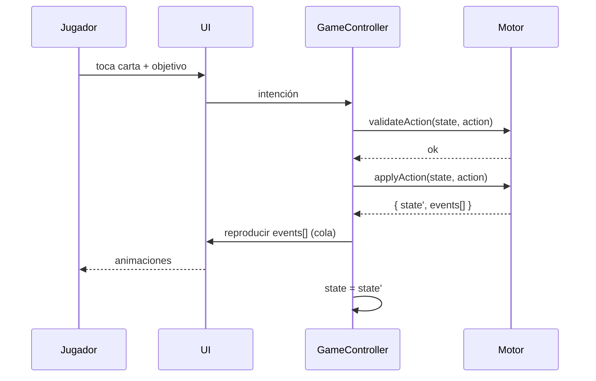

# 03 · Arquitectura

## Visión general



## Capas y responsabilidades

| Capa | Hace | No hace |
|---|---|---|
| **Datos** (`data/`) | Define cartas, héroes y constantes | Lógica |
| **Motor** (`core/engine`) | Valida y aplica acciones, emite eventos | Dibujar, esperar, conectarse a la red |
| **IA** (`core/ai`) | Elige la siguiente acción | Modificar el estado |
| **GameController** (cliente) | Traduce toques en acciones, guarda el estado, pone en cola los eventos | Decidir reglas |
| **Presentación** (cliente) | Anima los eventos en orden y muestra el estado | Calcular daño o legalidad (lo pregunta al motor) |
| **Servidor** | Es dueño del estado real, valida cada acción y envía a cada jugador su vista | Confiar en el cliente |

## Modelo de acciones y eventos

1. La UI detecta una intención («arrastré la carta 2 al héroe rival»).
2. El controlador construye una `Action` y la valida (`validateAction`). Si no es válida, la UI muestra el motivo (`reason` está en español).
3. `applyAction` devuelve un **estado nuevo** y una lista ordenada de **eventos** (`damaged`, `unitDied`, `phaseChanged`…).
4. La UI reproduce los eventos uno a uno con animación. Solo al terminar la cola muestra el estado final. Así la animación nunca contradice las reglas.



## Bucle de turno de la IA
```
mientras estado.current == IA y no hay ganador:
    acción = chooseAction(estado, datos, IA)
    { estado, eventos } = applyAction(estado, datos, acción)
    reproducir eventos (con las pausas de design/tokens motion.ai.*)
```

## Por qué el motor es puro y determinista
- **Servidor autoritativo**: el servidor ejecuta el mismo motor que el cliente y no hay que escribir las reglas dos veces si ambos usan TypeScript (ver ADR-0002).
- **Repeticiones y soporte**: semilla + lista de acciones reproducen cualquier partida exacta.
- **Pruebas**: el fuzzing y la simulación de balance usan el mismo código que el juego.
- **Ports**: los vectores de `data/test-vectors` prueban que un port a GDScript o C# se comporta igual.

## Información oculta
En línea, el cliente **no** recibe el `GameState` completo: recibe `viewFor(state, jugador)`, sin la mano ni el mazo del rival y sin el estado del RNG. Así el cliente no puede predecir los robos.

## Estructura recomendada del cliente móvil (cualquier motor)
```
app/
  core/            motor (import directo en RN, o port verificado en Godot/Unity)
  data/            copia de data/*.json (o descarga remota con versión)
  game/
    GameController     estado, cola de eventos, modo local u online
    EventPlayer        reproduce GameEvent[] → animaciones
    InputController    toque, arrastre, mantener pulsado para ver en grande
  ui/
    screens/       Inicio, SelecciónHéroe, Mesa, Resultado, Colección, Reglas, Ajustes
    components/    Card, Unit, HeroPanel, PowerButton, PhaseDisc, EnergyPips, Hand, Board, Log
  services/
    Persistence    partida en curso, ajustes, progreso (local)
    Net            WebSocket (v0.4)
    Analytics      eventos de producto (sin datos personales)
  assets/          design/assets + fuentes
```

## Versionado
- `rules.json.version` (semver) viaja en `GameState.rulesVersion`. El servidor rechaza clientes con otra versión mayor.
- `GameState.schema` sube cuando cambia la forma del estado. Las partidas guardadas en local se descartan si no coincide.
