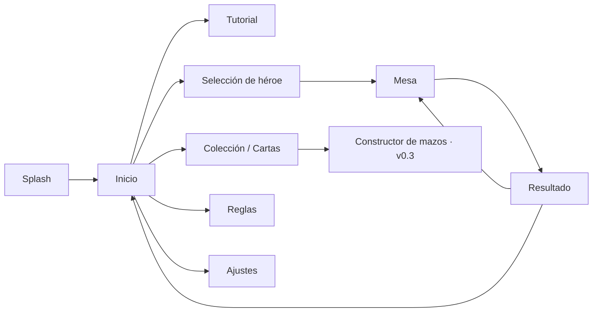

# 07 · UI/UX para móvil

Referencia visual: `prototype-web/eclipsia.html` (se puede abrir en el teléfono). Valores exactos: `design/tokens/tokens.json`.

## Mapa de pantallas


## Mesa (orientación vertical, 360–430 pt de ancho)
```
┌──────────────────────────────┐
│ [Retrato rival] 25 ♦ brasas  │  ← HeroPanel rival + dorsos de su mano
│ Poder rival (solo lectura)   │
├──────────────────────────────┤
│  ▢ ▢ ▢ ▢ ▢ ▢                 │  ← Tablero rival (hasta 6)
├──── ☀ Ronda 3 · Día ─[Fin]──┤  ← Disco de fase, pista, botón de fin
│  ▢ ▢ ▢ ▢ ▢ ▢                 │  ← Tu tablero
├──────────────────────────────┤
│ [Tu retrato] 25  ●●●○○ [Poder]│
│ ▭ ▭ ▭ ▭ ▭ →  (mano deslizable)│
└──────────────────────────────┘
```
En tablet y horizontal: panel lateral con la vista ampliada de la carta y la crónica.

## Interacciones
| Gesto | Resultado |
|---|---|
| Tocar una carta de la mano | Vista ampliada + seleccionada (en táctil, primer toque) |
| Tocar de nuevo o **arrastrar hacia la mesa** | Jugarla. Si pide objetivo, se resaltan los válidos |
| Arrastrar una carta hasta un objetivo | Jugarla directamente sobre ese objetivo |
| Tocar una criatura propia con brillo verde | Seleccionarla como atacante; los objetivos se marcan en rojo |
| Tocar un objetivo marcado | Confirmar |
| Tocar fuera o botón atrás | Cancelar la selección |
| Mantener pulsado cualquier carta | Vista ampliada con palabras clave explicadas |
| Botón «Terminar turno» | Pulsa cuando ya no te quedan jugadas |

Siempre pregunta al motor (`validTargets`, `attackTargets`, `canPlayCard`); la UI nunca calcula reglas por su cuenta. Muestra el `reason` de `validateAction` cuando una acción no se permite («Brasas insuficientes»).

## Estados visuales de los componentes
| Componente | Estados |
|---|---|
| Carta en mano | normal · jugable (halo verde) · seleccionada (se eleva y brilla en dorado) · no jugable (tiembla al tocar) |
| Criatura en mesa | dormida (desaturada, «z») · puede atacar (halo verde) · seleccionada · objetivo válido (borde rojo discontinuo, pulso) · Guardián (base en forma de escudo, borde más grueso) · Escudo (halo dorado) · herida (vida en rojo oscuro) · bono de fase (ataque brillante) · muriendo |
| Héroe | normal · objetivo válido · golpeado |
| Botón de poder | disponible · usado · sin brasas · seleccionado |
| Botón de fin | normal · destacado (sin jugadas) · deshabilitado (turno rival) |
| Mesa | ambiente de Día (cálido) · ambiente de Noche (azul, con transición de 1 s) |

## Orden de animación
Reproducir los `GameEvent` en orden, cada uno con la duración de `tokens.motion`. Los eventos que ocurren a la vez (daño simultáneo del combate) pueden ir en paralelo si son consecutivos y del mismo tipo.

## Accesibilidad
- Área táctil mínima de 44 pt. Las criaturas en pantallas pequeñas miden unos 56 pt: se amplían al tocarlas.
- No depender solo del color: Guardián cambia la forma y cada palabra clave tiene ícono.
- Respetar «reducir movimiento» del sistema (factor 0,3 en las duraciones).
- Tamaño de texto dinámico en las pantallas de menú. En la mesa, la vista ampliada cubre la lectura.
- VoiceOver/TalkBack: cada carta anuncia «Nombre, coste X, ataque Y, vida Z, texto».

## Sonido (por definir)
Eventos con sonido: robar, jugar, golpe, escudo roto, muerte, cambio de fase (campana de amanecer / grave de anochecer), victoria y derrota.

## Tutorial propuesto (5 pasos)
1. Jugar una criatura. 2. Atacar al héroe. 3. Guardián. 4. Cambio de fase con Polilla Nocturna. 5. Usar el poder de héroe.
